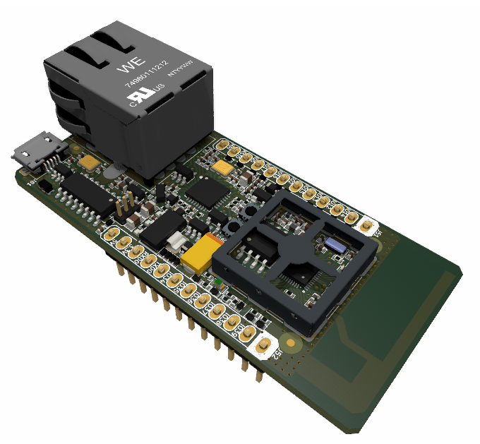
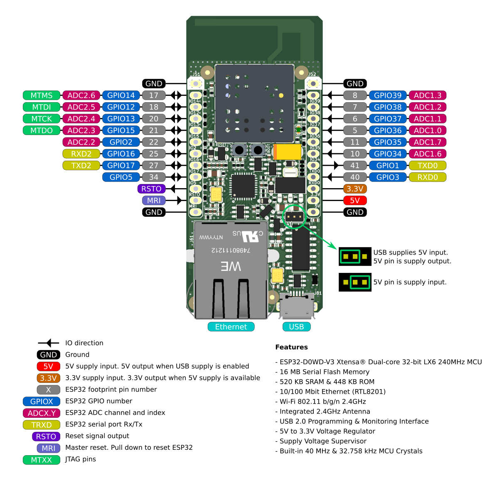
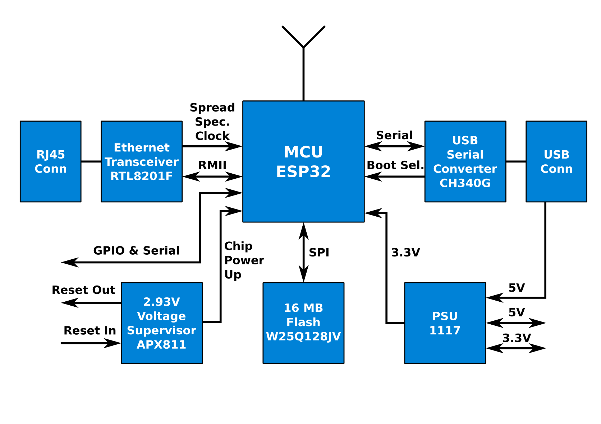

# ESP32 Ethernet, Wi-Fi & Serial Gateway

_Open Source Hardware Developed With Open Source Software_ [*](#development-software)

## Overview

<picture>
  <source media="(prefers-color-scheme: dark)" srcset="./pcb/3dviewb.png">
  <source media="(prefers-color-scheme: light)" srcset="./pcb/3dvieww.png">
  
</picture>

A hardware design which includes ESP32, Ethernet, Wi-Fi, USB and serial connectivity. **iot-esp-eth** is suitable to use as a gateway between Ethernet, Wi-Fi and serial. When used with [esp-at](https://github.com/espressif/esp-at) project, you can connect wired or wireless networks with AT commands sent to USB or serial ports. You may also operate it with custom firmware, since it is not different from a usual ESP32 development kit.

**iot-esp-eth** may be used as an attachment to a base board. Standalone usage with USB supply is possible as well.

ESP-IDF automatic bootloader activation is supported on USB port. This port is connected to UART0 of ESP32.

Schematic, PCB layout and antenna design are available in this repository. **iot-esp-eth** is compatible with many example projects at [espressif](https://github.com/espressif/) github repository.

## Table of Contents

- [PCB Design](./pcb/) : KiCAD project including schematic, layout, BOM, Gerber files.
- [Antenna Design](./antenna/) : OpenEMS project for PCB antenna design including simulation scripts, figures and prototype measurements.
- [Firmware](./firmware/) : espressif/esp-at project modified to include iot-esp-eth configuration.
- [Documents](./document/) : Project files for diagrams and documents.

## Pinout Diagram

## Block Diagram

## Datasheet

[UYS2101IA, UYS2101CA - ESP32 Ethernet, Wi-Fi & Serial Gateway](./document/uys2101.pdf)

## Features

- ESP32-D0WD-V3 Xtensa® Dual-core 32-bit LX6 240MHz MCU 
- 16 MB Serial Flash Memory
- 520 KB SRAM & 448 KB ROM
- 10/100 Mbit Ethernet (RTL8201F)
- Wi-Fi 802.11 b/g/n 2.4GHz
- Integrated 2.4GHz Antenna
- USB 2.0 Programming & Monitoring Interface
- 5V to 3.3V Voltage Regulator
- Supply Voltage Supervisor
- Built-in 40 MHz & 32.758 kHz MCU Crystals

## Development Software

This project was developed with open source tools including but not limited to KiCAD, OpenEMS, Octave, FreeCAD, Paraview, Inkscape and Scribus on a PC running Ubuntu Desktop edition.
