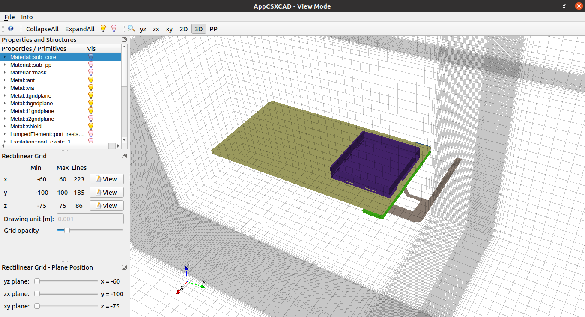
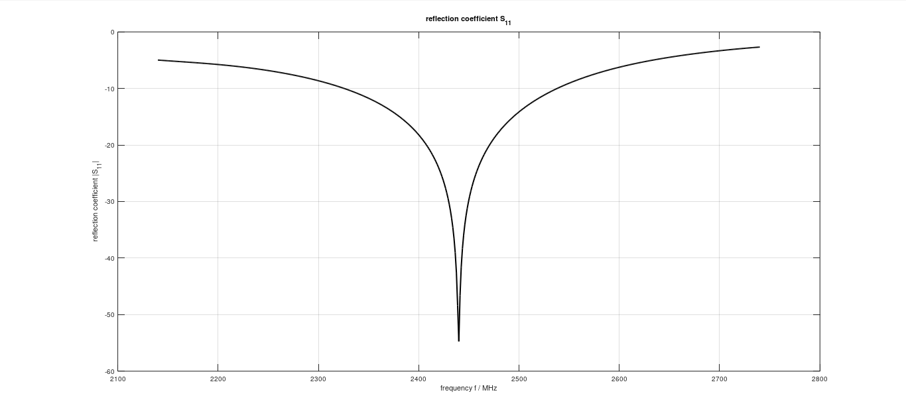
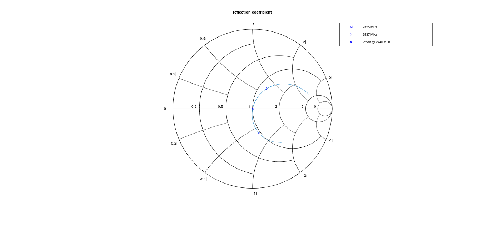
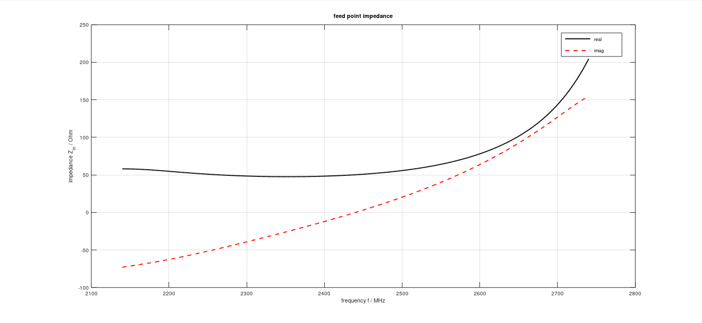
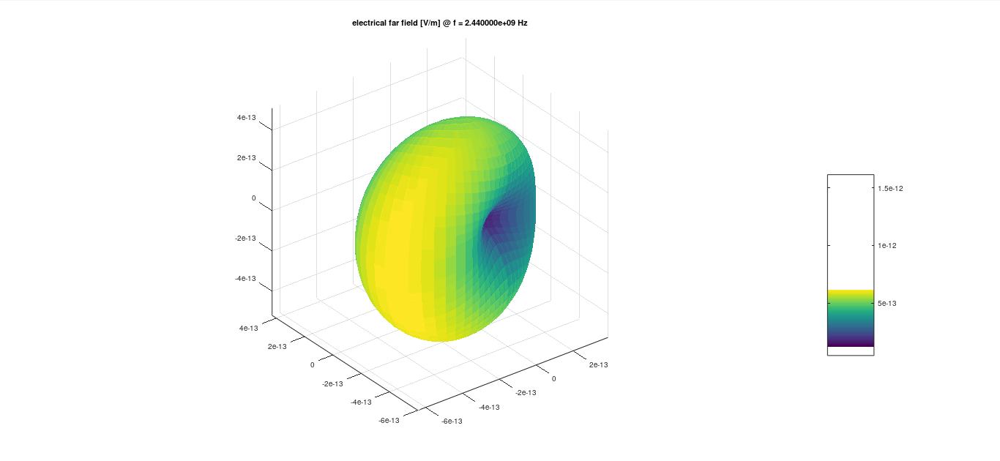
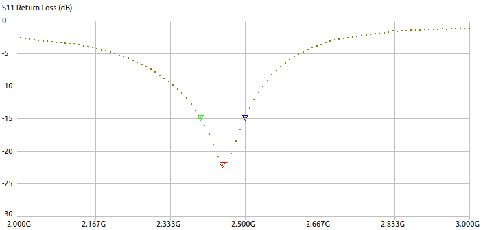
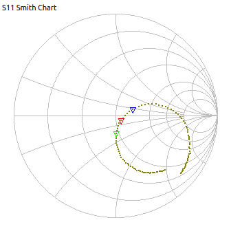
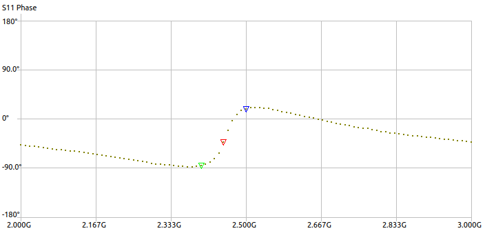

# ESP32 Ethernet, Wi-Fi & Serial Gateway

_Open Source Hardware Developed With Open Source Software_ [*](#development-software)

## Antenna Design, Simulation and Measurement

<picture>
  <source media="(prefers-color-scheme: dark)" srcset="../pcb/antviewb.png">
  <source media="(prefers-color-scheme: light)" srcset="../pcb/antvieww.png">
  
</picture>

Antenna simulations are made with OpenEMS. The board layout and critical components are defined as geometries in an Octave script.

Initially, coarse dimensions for Inverted-F antenna are obtained from text books and entered to script. Then many iterations are made with OpenEMS to match antenna impedance to 50 ohms at the center frequency (2440MHz). At the same time, VSWR should be acceptable for the operation range from 2400 to 2480 MHz.

The board layout is defined exactly the same as the 4-layer stack up definitions from the manufacturer. If another stack up or material to be used, simulations and prototypes should be updated accordingly.

When the simulation results are satisfactory, geometries are exported from AppCSXCAD and imported to KiCAD to draw the board edges and the antenna as exactly as possible.

Antenna measurements are made with a LiteVNA64. The calibration is done with high-frequency SMD resistors on the matching components' pads since using SMA or similar connectors alters the results drastically.

S1P file exported from VNA is imported to smith chart software (SimNEC) to calculate the matching component values to match ESP32 output impedance to 50 ohms antenna impedance.

It can be seen that the measurement results are consistent with the simulations.

View of geometries before simulation:

Simulated S11 parameters:

Simulated smith chart:

Simulated feed point impedance:

Simulated 3D radiation:

Measured S11 parameters:

Measured smith chart:

Measured phase graph:

## Files

[Octave Simulation Script](./simulation.m)

[Simulation Results And Figures](./simulation/)

[VNA Measurements](./measurement/)

[VNA Measurement Data](./measurement/measurement.s1p)

[Exported Geometries](./stl/)

## Development Software

This project was developed with open source tools including but not limited to KiCAD, OpenEMS, Octave, FreeCAD, Paraview, Inkscape and Scribus on a PC running Ubuntu Desktop edition.
