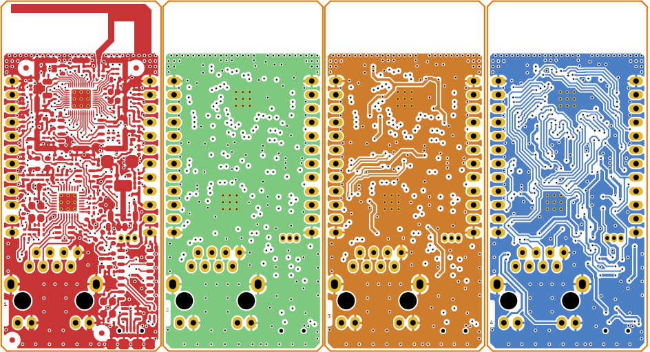
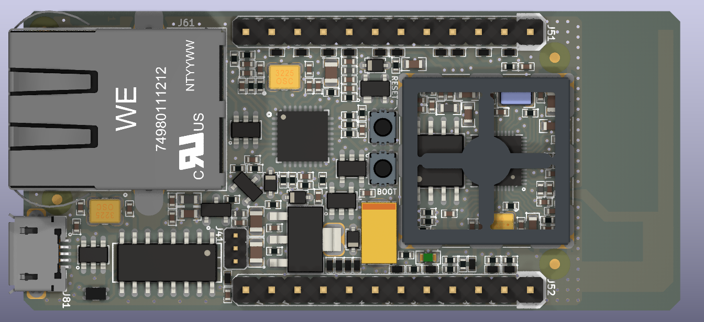
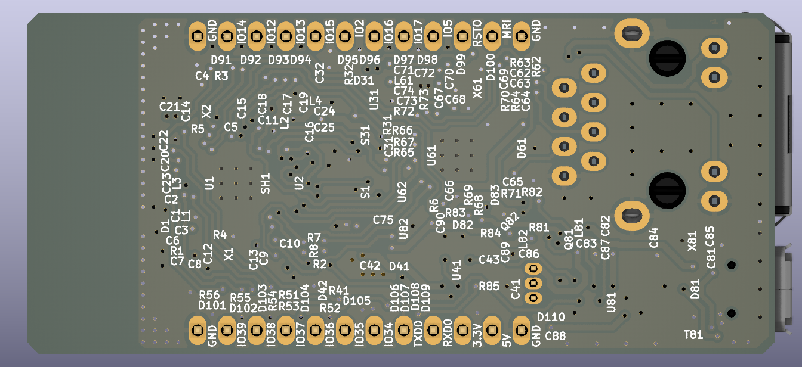

# ESP32 Ethernet, Wi-Fi & Serial Gateway

_Open Source Hardware Developed With Open Source Software_ [*](#development-software)

## Overview

> [!NOTE]
> This directory contains two versions of **iot-esp-eth** hardware design. There are small differences between board layouts, but bill of materials differ a lot. Components of the **iot-esp-eth-ind** board has an operating range of -40॰C to +85॰C, whereas the **iot-esp-eth-com** board is for 0॰C to 70॰C.
> Both have 4-layers and are designed according to the JLCPCB impedance controlled stack up of [JLC04161H-7628](https://jlcpcb.com/impedance).

**iot-esp-eth** design is based on Espressif ESP32-D0WD-V3 Xtensa® Dual-core 32-bit LX6 240MHz MCU. It has 520 kB SRAM and 448 kB ROM but no flash memory. Winbond W25Q128JVSIQ SPI flash chip is used as an application and data storage with a 16MB capacity. One 40MHz and one 32.768kHz crystal are used as clock sources of the MCU. These components are enclosed with an RF shield to decrease EMC interference.

Wi-Fi and 2.4GHz wireless are built in ESP32. The only required external component is an antenna. An Inverted-F type PCB antenna is designed for **iot-esp-eth** by using EM simulation tools. Since the output impedance of ESP32's RF amplifier is different from 50 ohms, an L-type matching circuit is populated.

ESP32 has an RMII interface. Realtek RTL8201F transceiver is connected through this interface for Ethernet connectivity. Ethernet transformers are included in the RJ45 connector and this leads to a compact design. Ethernet clock is generated by RTL8201F and supplied to the ESP32. This chip has spread spectrum ability to lower radiated emissions. There is a 3-state buffer (74AUP1G126) on the clock signal to disable the clock while ESP32 is initializing. The clock input of ESP32 (GPIO0) is a bootstrapped input.

**iot-esp-eth** has two extension pin headers in order to connect it to another custom design base boards.

ESP32's UART0 is used for flash programming and general purpose cases. This port is connected to both extension pin header and the Serial-USB converter chip (CH340G). There is an AND gate (74AHC1G08) between RXD pins to prevent shorts when USB and serial port pins are used at the same time. ESP-IDF's automatic bootloader activation is supported on USB port.

**iot-esp-eth** has an onboard 5 to 3.3V linear regulator. It is possible to supply the board with 5V or 3.3V via the extension headers. If USB power is available, 5V and 3.3V pins on the headers can supply exernal circuits.

There is a voltage supervisory chip to generate reset pulses 200ms wide when necessary or when the voltage drops below minimum required. Two buttons can be used to reset the circuit or enter serial bootloader after reset.

**iot-esp-eth** has ESD protection on extension headers, antenna, Ethernet and USB ports, and has common mode chokes on Ethernet and USB ports.

## Images

Copper layers:

Top view:

Bottom view:

## Development Software

This project was developed with open source tools including but not limited to KiCAD, OpenEMS, Octave, FreeCAD, Paraview, Inkscape and Scribus on a PC running Ubuntu Desktop edition.
