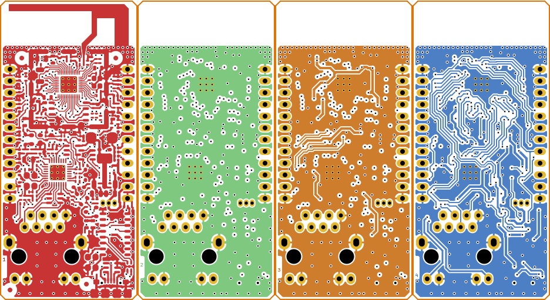
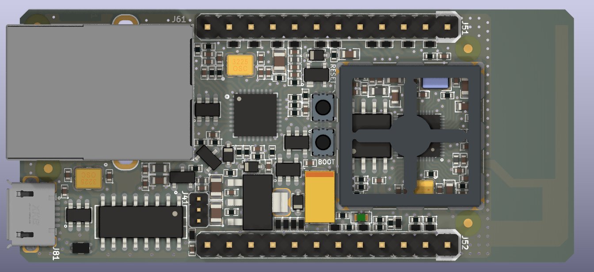
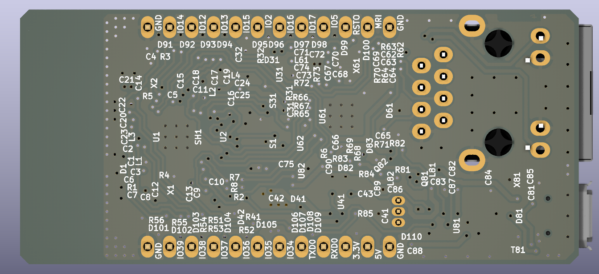

# ESP32 Ethernet, Wi-Fi & Serial Gateway

_Open Source Hardware Developed With Open Source Software_ [*](#development-software)

## Overview

This directory contains KiCAD project files, generated PCB images, Gerber, panel configuration files, interactive HTML based assembly list, bill of materials and position (pick & place) data.

Components of the **iot-esp-eth-com** board has an operating range of 0॰C to 70॰C. Board layout has 4-layers and is designed according to the JLCPCB impedance controlled stack up of [JLC04161H-7628](https://jlcpcb.com/impedance).

PCB panels can be automatically generated with KiKit (KiCAD plugin). Configuration files are in the related directory.

## Files

[Schematics](./iot-esp-eth-com.pdf)

[PCB Layers](./iot-esp-eth-com-layers.pdf)

[Bill of Materials](./iot-esp-eth-com-bom.csv)

[Position Data](./iot-esp-eth-com-all-pos.csv)

[Interactive assembly part list](./bom/ibom.html)

[Panel Configuration](./panel/config.json)

[Dimensions](./iot-esp-eth-com-dimensions.pdf)

## Images

Copper layers:

Top view:

Bottom view:

## Development Software

This project was developed with open source tools including but not limited to KiCAD, OpenEMS, Octave, FreeCAD, Paraview, Inkscape and Scribus on a PC running Ubuntu Desktop edition.
